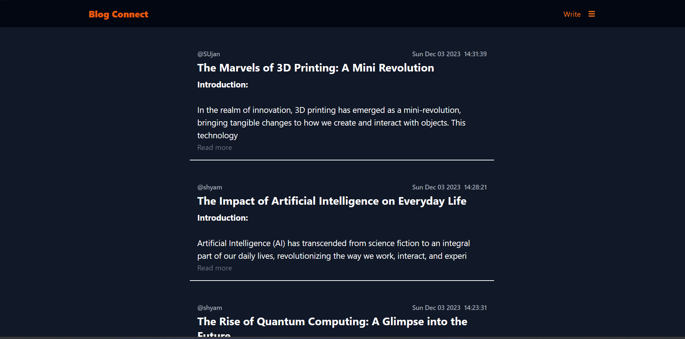
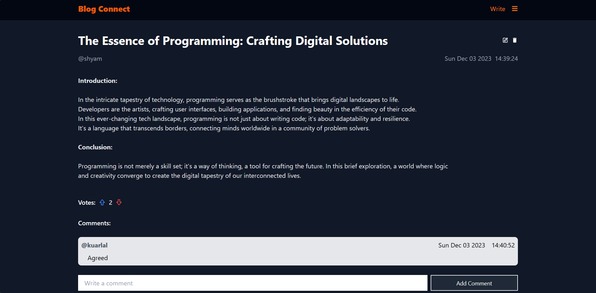

# Blog Connect

Blog Connect is a simple yet powerful blog application crafted for a college project using Node.js in the backend, React.js in the frontend, Tailwind CSS for styling, and MySQL as the database. This application provides users with the ability to register, log in, and log out securely, with JWT protection ensuring the security of user sessions. User passwords are hashed before being stored in the database, enhancing data security.




## Features

- **User Authentication:** Users can register, log in, and log out securely. JWT protection ensures the security of user sessions.

- **Blog Management:** Users can create, update, and delete blog posts. Each blog post includes a title and description.

- **Comment System:** Users can comment on blog posts. Authors have the ability to update and delete comments.

- **Voting System:** A robust voting system allows users to vote on blog posts. The voting score is determined by calculating the difference between total upvotes and total downvotes for each post.

- **Account Management:** Users can update their account information and also choose to delete their accounts.

## Tech Stack

- **Backend:** Node.js
- **Frontend:** React.js
- **Styling:** Tailwind CSS
- **Database:** MySQL

## Setup

1. Clone the repository:

   ```bash
   git clone https://github.com/BabaYaGa74/blog-connect.git
   ```

2. Navigate to the project directory:

   ```bash
   cd blog-connect
   ```

3. Install dependencies for both backend and frontend:

   ```bash
   cd backend
   npm install
   cd ../frontend
   npm install
   ```

4. Configure the MySQL database by updating the `dbConfig.js` file in the `./backend/config/` directory with your database credentials.

5. Run the application:

   ```bash
   # Start the backend server
   cd backend
   npm run server

   # Start the frontend
   cd ../frontend
   npm run dev
   ```

6. Open your browser and navigate to `http://localhost:5173` to use this Blog application.
